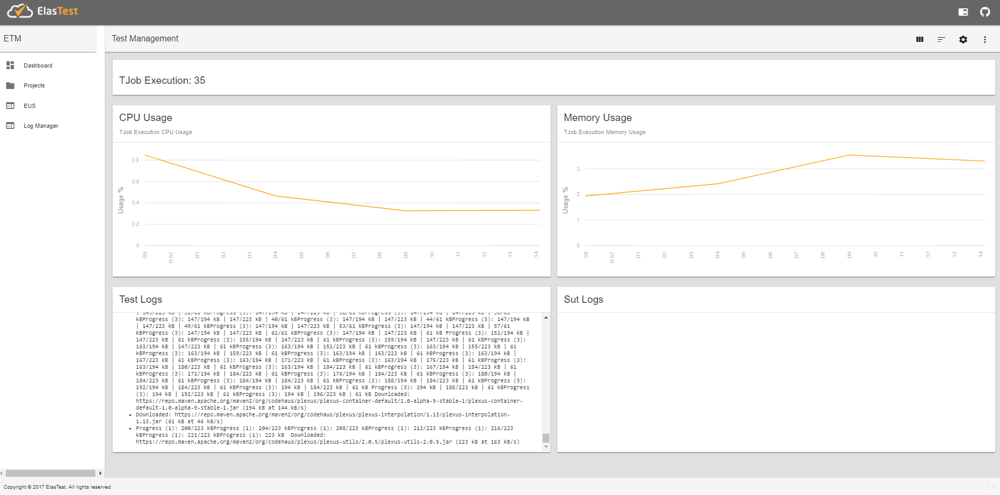
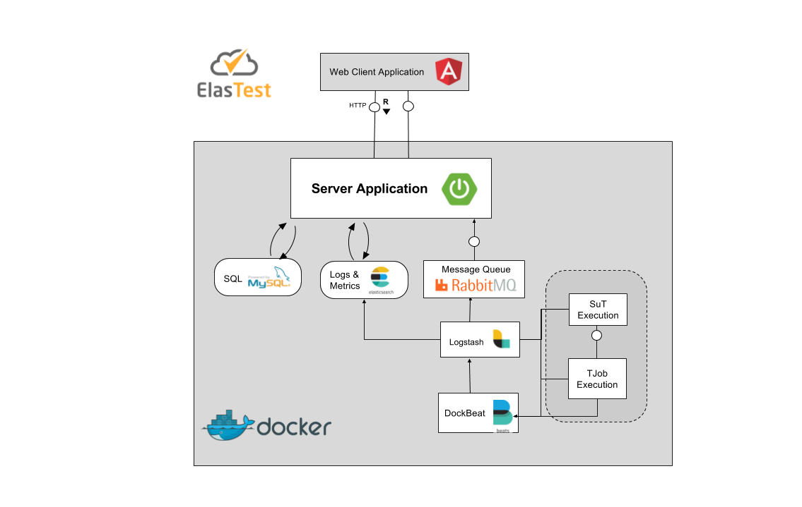

# Elastest Test Recommendation and Orchestrator Manager
The Test Orchestration and Recommendation Manager (TORM) is the brain of ElasTest and the main entry point for developers. TORM will provide a web interface to be used by testers, developers and administrators, to managing tests, test executions, systems under test, orchestrate tests and analyze logs. It will also provide a remote API that will used by ElasTest-CLI (a command line interface tool), by ElasTest Jenkins Plugin and by ElasTest Eclipse Plugin.

Before you start using ElasTest, you need to know the following terms:

- **Project**: Set of test specifications.
- **TJob**: Specification of a Test to run against any software.
- **SuT (System under Test):** Specification of the System that is being tested for correct operation.

## Features
The version 0.1 of the ElasTest TORM, provides the following features:

- Projects Management. 
- TJobs Management.  
- SuTs Management.
- Logs Management.

## How to run
To start using ElasTest, you need to follow the next steps. Several of these steps, are specific for Windows or Linux Operating Systems.

### Windows 
1.  Install [Docker Toolbox for windows](https://docs.docker.com/toolbox/toolbox_install_windows/).
Start Boo2docker Virtual Machine from Virtual Box GUI and connect via ssh. Execute `docker-machine ssh` from power shell or any terminal emulator. 
2.  Install [Docker Compose](https://docs.docker.com/compose/install/.) on the Virtual Machine Boot2docker created by Docker Toolbox installation. 
    - `sudo -i` (get access as superuser)    
    - ``curl -L https://github.com/docker/compose/releases/download/1.14.0/docker-compose-`uname -s`-`uname -m` > /usr/local/bin/docker-compose``
    - `chmod +x /usr/local/bin/docker-compose` 

3. Elasticsearch requires an increase of the max virtual memory to at least 262144 `sudo sysctl -w vm.max_map_count=262144`
4. Switch Docker API to non-TLS port.
    - Edit the file */var/lib/boot2docker/profile* with any editor `sudo vi /var/lib/boot2docker/profile`
    - Change the DOCKER_HOST value to be *'-H tcp://0.0.0.0:2375'*
    - Change the DOCKER_TLS value to be *no*.
    - Execute `exit` in the shell to leave SSH session.
    - Restart Boot2docker `docker-machine restart`


>**Note:** To this day, for each time the docker machine reboots, you will have to repeat the steps 2 and 3.

### Linux 
1. Install [Docker](https://docs.docker.com/engine/installation/).  
2. Install [Docker Compose](https://docs.docker.com/compose/install/).
    - `sudo -i` (get access as superuser)  
    - ``curl -L https://github.com/docker/compose/releases/download/1.14.0/docker-compose-`uname -s`-`uname -m` > /usr/local/bin/docker-compose``
    - `chmod +x /usr/local/bin/docker-compose` 

    > **Note:** For use Docker Compose file Version 2.1 you need Docker Engine version 1.12.0+ and Compose 1.9.0+.
    
3. Elasticsearch requires an increase of the max virtual memory to at least 262144. 
    - `sudo sysctl -w vm.max_map_count=262144`

4. Enable the tcp Socket.
    - Create the docker.conf file at the path `/etc/systemd/system/docker.service.d/docker.conf`
    - Edit file and add the following three lines:
    ```
    [Service]
    ExecStart=
    ExecStart=/usr/bin/dockerd -H tcp://0.0.0.0:2375 -H unix:///var/run/docker.sock
    ```
    > **Note:** If the directory *docker.service.d* does not exist, then you need create it.
    > **Note:** In some cases it would be required to explicitly set and export the environmental variable `DOCKER_HOST=tcp://0.0.0.0:2375`. Please in case you adopt a different port, fix this variable accordingly.

5. Reload configuration.
    - `systemctl daemon-reload`
6. Restart docker service.
    - `systemctl restart docker.service`

### Download ElasTest TORM 
- Create a directory named *elastest-torm*, and change your current directory to this one.

- Download the docker compose file from the ElasTest TORM repository  
 `wget https://raw.githubusercontent.com/elastest/elastest-torm/master/docker-compose.yml`

    >**Note:** On Windows you must be inside boot2docker (`docker-machine ssh`).

### Start and stop ElasTest TORM
- `cd elastest-torm`
- `docker-compose -p elastest up `
- To stop ElasTest TORM preferably run: `docker-compose -p elastest down `, otherwise press `Ctrl+C` in the shell

>**Note:** To run the latest version of ElasTest TORM you need to execute the command `docker image pull elastest/etm`, before running the docker-compose command.

## Basic usage
To use ElasTest and run your first test, you need to create at least one project and a TJob associated to the project. For this, start a Web Browser and enter the following URL:
- Linux: http://localhost:8091/ 
- Windows: http://192.168.99.100:8091/ (replace 192.168.99.100 with result of command `docker-machine ip`)

</p>

### Create a Project.
- Click on item *Projects* in the menu on the left.
- Create a new Project. Fill in the field *Project Name* and click on *SAVE* button.
- Select the project by clicking on the row.
   
### Create a TJob
- From the Project management page, create a new TJob. In the TJobs card click on the button *New TJob*. Fill in the fields *TJob Name* and *Image Name*. The image's name must be refer to a docker image with the test to run inside.
    
### Execute a TJob
- From the list of TJobs you can execute a TJob by clicking on the play button.
- Then you will see the logs and metrics generated by the TJob execution.<p>
</p>

## Development documentation

### Arquitecture
The ElasTest TORM Platform is divide in three parts:
- ElasTest TORM Web Client Application.
- ElasTest TORM Server Application.
- ElasTest TORM Platform Services.

In the next diagram, you can to see The ElasTest TORM Components Architecture.



#### ElasTest TORM Web Client Application
This appication provides a friendly GUI to ElasTest TORM Platform, allowing to the users managment theirs test in a simple way. 

#### ElasTest TORM Server Application 
This application is the ElasTest TORM backend that provides the API to the Web Client Application to access the resources and implements integration with the rest of the platform services. It is a Java Application developed with SpringBoot, the Spring solution for creating stand-alone applications as quickly as possible.

#### ElasTest TORM Platform Services
ElasTest TORM uses several external components to implement the features it offers. These services are shown in the diagram and described below.

- **[MySql DB:](https://www.mysql.com/)** The DDBB System that uses the ElasTest TORM to store the persistent data, necessary to manage the Projects, TJobs, Suts and Executions.
- **[Logstash:](https://www.elastic.co/products/logstash)** As indicated on its website *"It is a server-side data processing pipeline that ingests data from a multitude of sources simultaneously, transforms it, and then sends it to your favorite *stash*"*. ElasTest TORM uses it to gather and parse logs and metrics produced by the execution of TJobs and SuTs. The logs and metrics are sent to Elasticsearch and RabbitMq servers.
- **[Dockbeat:](https://www.elastic.co/products/beats)** As indicated on its website "*Beats is the platform for single-purpose data shippers. They install as lightweight agents and send data from hundreds or thousands of machines to Logstash or Elasticsearch*". ElasTest TORM uses it to retrive container metrics generated from the docker containers executing TJobs and SuTs and send them to Logstash service.
- **[RabbitMQ:](https://www.rabbitmq.com/)** It is a message broker used as communication bus in ElasTest. It is used by ElasTest TORM to show in the web GUI metrics and logs.
	
### Prepare development environment

First, be sure you can execute ElasTest TORM in production as specified in section [How to run].

Then, install the following development tools:
- [Java JDK 8](http://www.oracle.com/technetwork/java/javase/downloads/jdk8-downloads-2133151.html)
- [Maven 3.3.9](https://maven.apache.org/download.cgi)
- [Eclipse IDE](https://eclipse.org/ide/) or similar for Javan development.
- [Visual Studio Code](https://code.visualstudio.com/) or similar for Angular development.
- [Angular CLI](https://cli.angular.io/) 

Last, clone the repository in a local folder (for example, `/git`):

```
cd /git
git clone https://github.com/elastest/elastest-torm
```

> **Note:** In windows, only folders within `C:\Users\` can be used inside Docker VM. If you clone the git repository outside of `C:\Users\`, then you need to share git folder with the VM in VirtualBox interface following [these instructions](http://support.divio.com/local-development/docker/how-to-use-a-directory-outside-cusers-with-docker-toolbox-on-windows).

### Development procedure

#### Start and stop ElasTest TORM platform services
First, you need to start platform services before you can execute TORM Server and Client applications. Execute the following commands from console:

- `cd /git/elastest-torm`
- `docker-compose -f docker-compose-dev.yml up`

To stop ElasTest services, you should run in a shell:
- `docker-compose -f docker-compose-dev.yml up`

Possibly also pressing `Ctrl+C` in the shell should work, but make sure all the docker environment has been actually clean.

 > **Note:** On Windows you must execute this commands inside the VM (`docker-machine ssh`). 

#### ElasTest TORM Server Application

First, if you are on windows, you have to update the file `git/elastest-torm/elastest-torm/src/main/resources/application.properties` to make the property `services.ip` pointing to the docker VM IP. For example, if command `docker-machine ip` returns `192.168.99.100`, then you have to replace `services.ip=localhost` by `services.ip=192.168.99.100`.

You can develop ElasTest TORM Server Application using an editor and the command line or using Eclipse IDE:
* Using *Eclipse IDE*: 
  * Load project in the IDE: 
    * Import *elastest-torm* project from local Git Repository using `File > Import... > Maven > Import existing project` option option and select the `/git/elastest-torm/elastest-torm` folder.
  * Compile and execute the project:
    * Right click over the project and select `Run as...> Java Application` and select class `ElastestETMSpringBoot`.

* Using editor and console:
    * Compile and execute the project: 
      * Go to the root directory of the project with `cd /git/elastest-torm/elastest-torm`
      * Configure the property file in `src/main/resources/application.properties`
      * Compile the project `mvn clean package`
      * Execute command `mvn spring-boot:run`

     >**Note:** Building the project may require root privileges for running the test `DockerServiceItTest`. Either execute the TORM as root or skip such test.
     
      
The server application can be used from the web interface (see next section). By default the endpoint of the ElasTest TORM Server Application should be located at URL `http://localhost:8091`, 
the exposed API could be checked at `http://localhost:8091/swagger-ui.html#/`.

If you change any source file, you need to stop the service and start it again.

#### ElasTest TORM Client Application

You can develop ElasTest TORM Web Client Application using and editor and the command line or using Visual Studio Code:

* Using *Visual Studio Code*:
  * Load project in the IDE:
    * Open the project folder using `File > Open folder` option and select the `/git/elastest-torm/elastest-torm-gui`.
    * Open the integrated terminal with `View > Integrated Terminal`
    * Execute `npm install` to download the libraries
  * Compile and execute the project:    
    * Execute `npm start`

* Using editor and console:
  * Prepare the project:
    * Go to the project folder with `cd /git/elastest-torm/elastest-torm-gui`
    * Execute `npm install` to download the libraries
  * Compile and execute the project:    
    * Execute `npm start`

The client application can be used loading the URL http://localhost:4200 in a browser.

If you change any source file, the client will be restarted automatically on save.
