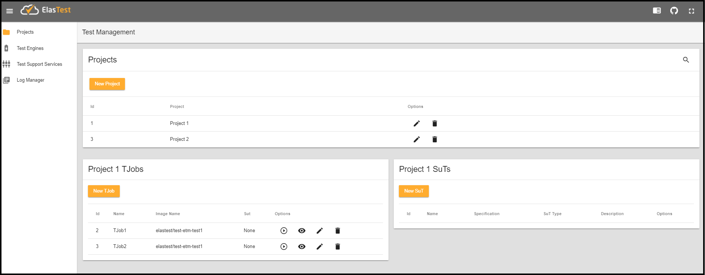
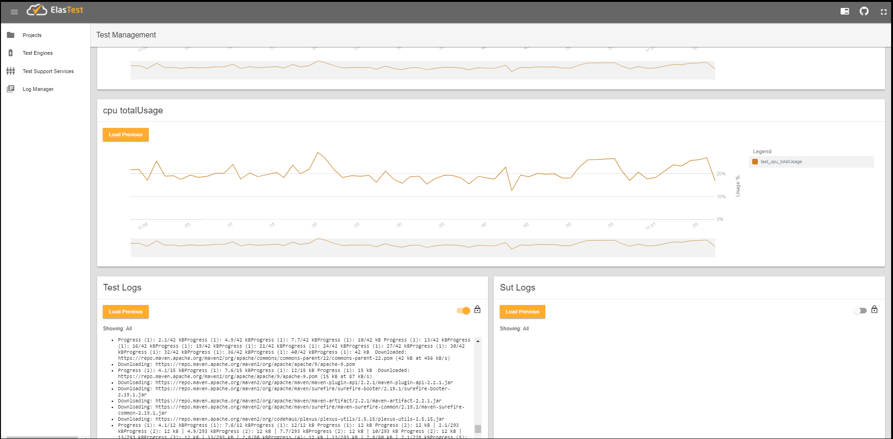

# Elastest Test Orchestrator and Recommendation Manager
The Test Orchestration and Recommendation Manager (TORM) is the brain of ElasTest and the main entry point for developers. TORM will provide a web interface to be used by testers, developers and administrators, to managing tests, test executions, systems under test, orchestrate tests and analyze logs. It will also provide a remote API that will used by ElasTest-CLI (a command line interface tool), by ElasTest Jenkins Plugin and by ElasTest Eclipse Plugin.

Before you start using ElasTest, you need to know the following terms:

- **Project:** Set of test specifications.
- **TJob:** Specification of a Test to run against any software.
- **SuT (System under Test):** Specification of the System that is being tested for correct operation.
- **TSS (Test Support Services):** On-demand services that provide additional functionality such as dynamic provisioning of web browsers, or devices for testing. These services can be provisioned associated with a TJob, to be used by the tests.
- **TE (Test Engines):** On-demand services that unlike TSS, will not be associated with a particular TJob, but will serve all TJobs running on the platform.

## Features
The current version of the ElasTest TORM (0.5.0-alpha2-SNAPSHOT), provides the following features:

- Projects Management.
- TJobs Management.
- SuTs Management.
- Logs Management.
- TSS Management.
- TE Management.

## How to run
To start using ElasTest, you need to follow the next steps. Several of these steps, are specific for Windows, Mac or Linux Operating Systems.

### Windows Prerequisites
1.  Install [Docker Toolbox for Windows](https://docs.docker.com/toolbox/toolbox_install_windows/) or [Docker for Windows](https://docs.docker.com/docker-for-windows/install/) (the choice will depend on whether or not your operating system meets the requirements).

2.  Set Docker Machine Env (only for Docker Toolbox installation)

    To be able to use the docker tools, provides by Docker Toolbox installation from any terminal or CMD (CMD, powerShell, ConEmu...), you need to set the following environment variables:
    - `SET DOCKER_TLS_VERIFY=1`
    - `SET DOCKER_HOST=tcp://docker-machine-ip:2376` (replace docker-machine-ip with result of execute the command `docker-machine ip`)
    - `SET DOCKER_CERT_PATH=C:\Users\logedUser\\.docker\machine\machines\default`

    >**Note:** If the virtual machine that creates the Docker Toolbox installation by default, does not have the necessary resources, you can always create a custom one using the [*docker-machine*](https://docs.docker.com/machine/get-started/#use-machine-to-run-docker-containers) tool.

### Linux Prerequisites
1. Install [Docker](https://docs.docker.com/engine/installation/).

### Mac Prerequisites
1. Install [Docker Toolbox for Mac](https://docs.docker.com/toolbox/toolbox_install_mac/) or [Docker for Mac](https://docs.docker.com/docker-for-mac/install/) (the choice will depend on whether or not your operating system meets the requirements).

2. Set Docker Machine Env (only for Docker Toolbox installation)

    To be able to use the docker tools, provides by Docker Toolbox installation from any terminal, you need to set the following environment variables:

    - `export DOCKER_TLS_VERIFY=1`
    - `export SET DOCKER_HOST=tcp://docker-machine-ip:2376` (replace docker-machine-ip with result of execute the command `docker-machine ip`)
    - `export DOCKER_CERT_PATH=/Users/logedUser\.docker\machine\machines\default`

    >**Note:** Just like on windows, if the virtual machine that creates the Docker Toolbox installation by default, does not have the necessary resources, you can always create a custom one using the docker-machine tool.

### Execute ElasTest
To know how to start ElasTest, follow the instructions given in the [ElasTest Platform](https://github.com/elastest/elastest-toolbox/blob/master/docs/index.md) documentation. 
For example, the command to run ElasTest in `lite` mode is :

```docker run --rm -v /var/run/docker.sock:/var/run/docker.sock elastest/platform start --lite```
 
## Basic usage
To access the ElasTest GUI you need to load the ElasTest home page in a web browser:
- Linux, Mac and Windows with Docker: http://localhost:37006/ 
- Windows and Mac with Docker Toolbox: http://docker-machine-ip:37006/ 
- Server mode: http://server-ip:37006/

>**Note:** The value of the *ElasTest ip* (docker-machine-ip or server-ip) depends on the parameter `--server-address` with which the platform was started. To learn more about ElasTest start parameters, read the ElasTest Platform  [documentation](https://github.com/elastest/elastest-toolbox/blob/master/docs/index.md).

</p>

Before you can do your first test, you need to create at least one project and a TJob associated to the project.

### Create a Project.
- Click on item *Projects* in the menu on the left.
- Create a new Project. Fill in the field *Project Name* and click on *SAVE* button.
- Select the project by clicking on the row.
   
### Create a TJob
- From the Project management page, create a new TJob. In the TJobs card click on the button *New TJob*. Fill in the mandatory fields. The image's name must be refer to a docker image with the test to run inside.
    
### Execute a TJob
- From the list of TJobs you can execute a TJob by clicking on the play button.
- Then you will see the logs and metrics generated by the TJob execution.<p>
</p>

## Development documentation

### Arquitecture
The ElasTest TORM Platform is divide in three parts:
- ElasTest TORM Web Client Application.
- ElasTest TORM Server Application.
- ElasTest Services.

In the next diagram, you can to see The ElasTest TORM Components Architecture.


#### ElasTest TORM Web Client Application
This appication provides a friendly GUI to ElasTest TORM Platform, allowing to the users managment theirs test in a simple way. 

#### ElasTest TORM Server Application 
This application is the ElasTest TORM backend that provides the API to the Web Client Application to access the resources and implements integration with the rest of the ElasTest services. It is a Java Application developed with SpringBoot, the Spring solution for creating stand-alone applications as quickly as possible.

#### ElasTest TORM Services
ElasTest TORM uses several external components to implement the features it offers. These services are shown in the diagram and described below.

- **[MySql DB:](https://www.mysql.com/)** The DDBB System that uses the ElasTest TORM to store the persistent data, necessary to manage the Projects, TJobs, Suts and Executions.
- **[Logstash:](https://www.elastic.co/products/logstash)** As indicated on its website *"It is a server-side data processing pipeline that ingests data from a multitude of sources simultaneously, transforms it, and then sends it to your favorite *stash*"*. ElasTest TORM uses it to gather and parse logs and metrics produced by the execution of TJobs and SuTs. The logs and metrics are sent to Elasticsearch and RabbitMq servers.
- **[Dockbeat:](https://www.elastic.co/products/beats)** As indicated on its website "*Beats is the platform for single-purpose data shippers. They install as lightweight agents and send data from hundreds or thousands of machines to Logstash or Elasticsearch*". ElasTest TORM uses it to retrive container metrics generated from the docker containers executing TJobs and SuTs and send them to Logstash service.
- **[RabbitMQ:](https://www.rabbitmq.com/)** It is a message broker used as communication bus in ElasTest. It is used by ElasTest TORM to show in the web GUI metrics and logs.
	
### Prepare development environment

First, be sure you can execute ElasTest TORM in production as specified in section [How to run](https://github.com/elastest/elastest-torm/blob/master/docs/index.md#how-to-run).

Then, install the following development tools:
- [Java JDK 8](http://www.oracle.com/technetwork/java/javase/downloads/jdk8-downloads-2133151.html)
- [Maven 3.3.9](https://maven.apache.org/download.cgi)
- [Eclipse IDE](https://eclipse.org/ide/) or similar for Javan development.
- [Visual Studio Code](https://code.visualstudio.com/) or similar for Angular development.
- [Angular CLI](https://cli.angular.io/) 

Last, clone the repository in a local folder (for example, `/git`):

```
cd /git
git clone https://github.com/elastest/elastest-torm
```

> **Note:** In windows, only folders within `C:\Users\` can be used inside Docker VM. If you clone the git repository outside of `C:\Users\`, then you need to share git folder with the VM in VirtualBox interface following [these instructions](http://support.divio.com/local-development/docker/how-to-use-a-directory-outside-cusers-with-docker-toolbox-on-windows).

### Development procedure
First, you need to start the ElasTest Services, before you can execute TORM Server and Client applications. You can do it in two ways:
 - Start the services using the [*ElasTest Platform*](https://github.com/elastest/elastest-toolbox) tool. This is the preferred option as it can be used on any operating system with docker installed.
 - Start the services using the *docker-compose* tool. On Windows it will be necessary to install Docker Compose inside the boo2docker VM.

#### Start ElasTest TORM Services using ElasTest Platform
If you choose this option, you only need to execute the following command:

```docker run --rm -v /var/run/docker.sock:/var/run/docker.sock elastest/platform start --lite --dev=etm -l```

>**Note:** For more information about this command you can see the ElasTest Platform [documentation](https://github.com/elastest/elastest-toolbox/blob/master/docs/index.md#start-command).

#### Start ElasTest TORM Services using Docker Compose
Execute `cd /git/elastest-torm/docker` on console to enter on folder that contains docker-compose files and follow the next instructions:

##### Start without ports binding
To start Elastest services without ports binding run the following command:
- `docker-compose -f docker-compose-complementary.yml -f docker-compose-main.yml -f docker-compose-lite.yml -p elastest up`

##### Start with ports binding
To start Elastest services with ports binding run the following command:
- `docker-compose -f docker-compose-complementary.yml -f docker-compose-complementary-ports.yml -f docker-compose-main.yml -f docker-compose-main-ports.yml -f docker-compose-lite.yml -p elastest up`

#### Stop ElasTest TORM Services using ElasTest Platform
To stop the services, you must run the following command:
- `docker run --rm -v /var/run/docker.sock:/var/run/docker.sock elastest/platform stop`

#### Stop ElasTest TORM Services using Docker Compose
To stop the services, you must run the following command in a shell one of the following commands:

##### Stop without ports binding
- `docker-compose -f docker-compose-complementary.yml -f docker-compose-main.yml -f docker-compose-lite.yml -p elastest down`

##### Stop with ports binding
- `docker-compose -f docker-compose-complementary.yml -f docker-compose-complementary-ports.yml -f docker-compose-main.yml -f docker-compose-main-ports.yml -f docker-compose-lite.yml -p elastest down`

>**Note:** Possibly also pressing `Ctrl+C` in the shell should work, but make sure all the docker environment has been actually clean.

#### Start ElasTest TORM Server Application

Depending on whether you are using [Docker](https://www.docker.com/what-docker) or [Docker Toolbox Tool](https://www.docker.com/products/docker-toolbox), you must define the following environment variables:

|   | With Docker Toolbox  | With Docker  |
|---|---|---|
| Environment Variables  |<ul><li>`ET_PUBLIC_HOST=docker-machine-ip` => VM Ip where ElasTest is running. The *docker-machine-ip* value, should be changed to the value returned by the execution of the `docker-machine ip` command. </li><li>`ET_IN_PROD`=false => The false value of this variable indicates that you want to run ElasTest in development mode</li><li>`DOCKER_TLS_VERIFY=1`</li><li>`SET DOCKER_HOST=tcp://docker-machine-ip:2376` (replace docker-machine-ip with result of execute the command `docker-machine ip`)</li><li>`DOCKER_CERT_PATH=/Users/logedUser\.docker\machine\machines\default`</li></ul>  |<ul><li>`ET_IN_PROD`=false => The false value of this variable indicates that you want to run ElasTest in development mode.</li></ul> |


You can develop ElasTest TORM Server Application using an editor and the command line or using Eclipse IDE:
* Using *Eclipse IDE*: 
  * Load project in the IDE: 
    * Import *elastest-torm* project from local Git Repository using `File > Import... > Maven > Import existing project` option and select the `/git/elastest-torm/elastest-torm` folder.
  * Define the environment variables. Go to `Run -> Run Configurations...` and Select tab `Environment`. You can create the variables you need by clicking on the button with the text `New`.
  * Compile and execute the project:
    * Right click over the project and select `Run as...> Java Application` and select class `ElastestETMSpringBoot`.

* Using editor and console:
    * Compile and execute the project: 
      * Go to the root directory of the project with `cd /git/elastest-torm/elastest-torm`
      * Configure the property file in `src/main/resources/application.properties`
      * Compile the project `mvn clean package`
      * Execute the expring boot application with the command `mvn spring-boot:run` by adding the necessary environmet variables `mvn spring-boot:run -DmyEnvVariable=value....`

     >**Note:** Building the project may require root privileges for running the test `DockerServiceItTest`. Either execute the TORM as root or skip such test.
     
The server application can be used from the web interface [(see next section)](https://github.com/elastest/elastest-torm/blob/master/docs/index.md#start-elastest-torm-client-application). By default the endpoint of the ElasTest TORM Server Application should be located at URL `http://localhost:8091`, 
the exposed API could be checked at `http://localhost:8091/swagger-ui.html#/`.

If you change any source file, you need to stop the service and start it again.

#### Start ElasTest TORM Client Application

You can develop ElasTest TORM Web Client Application using and editor and the command line or using Visual Studio Code:

* Using *Visual Studio Code*:
  * Load project in the IDE:
    * Open the project folder using `File > Open folder` option and select the `/git/elastest-torm/elastest-torm-gui`.
    * Open the integrated terminal with `View > Integrated Terminal`
    * Execute `npm install` to download the libraries
  * Compile and execute the project:    
    * Execute `npm start`

* Using editor and console:
  * Prepare the project:
    * Go to the project folder with `cd /git/elastest-torm/elastest-torm-gui`
    * Execute `npm install` to download the libraries
  * Compile and execute the project:    
    * Execute `npm start`

The client application can be used loading the URL http://localhost:4200 in a browser.

If you change any source file, the client will be restarted automatically on save.
