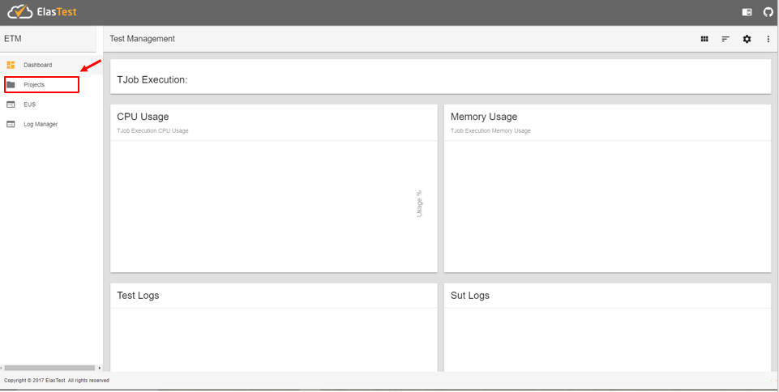
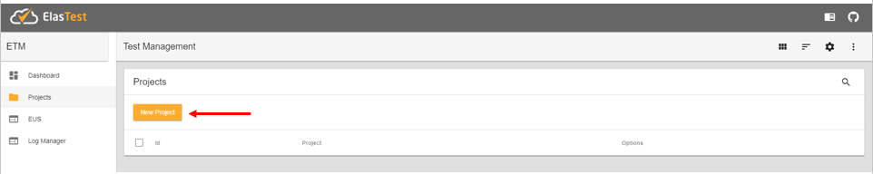
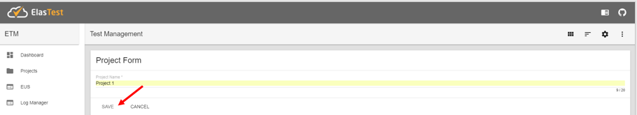
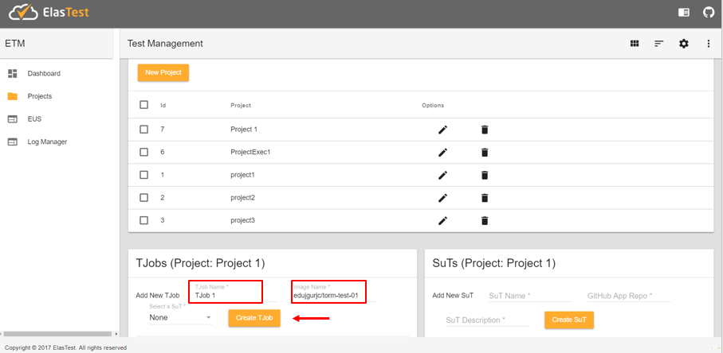
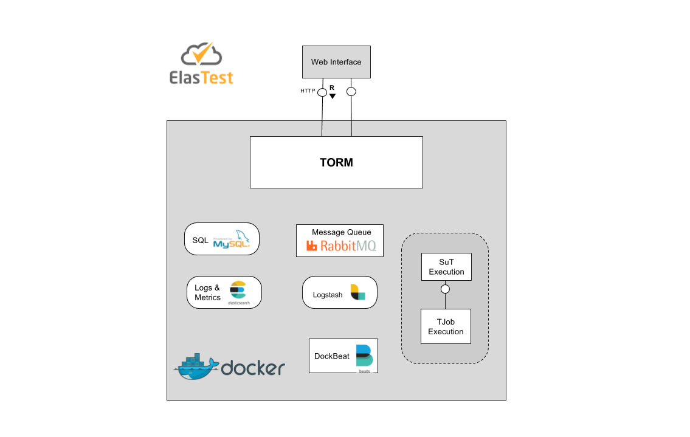
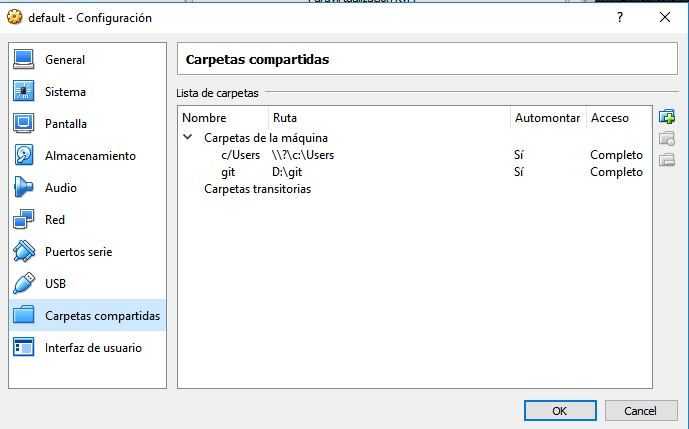

# Elastest Test Recommendation and Orchestrator Manager
The Test Orchestration and Recommendation Manager (TORM) is the brain of ElasTest and the main entry point for developers. TORM allows developers and testers managing tests, systems under test, orchestrate tests, analyze logs and much more.

## Terminology
Before you start using ElasTest, you need to know the following terms:

- **Project**: Set of test specifications.
- **TJob**: Specification of a Test to run against any software.
- **SuT (System under Test):** Specification of the System that is being tested for correct operation.

## Features
Features provided in the version 0.1 of the TORM component.

- Projects Management. 
- TJobs Management.  
- SuTs Management.
- Logs Management.

## Execute ElasTest TORM
To start using ElasTest, you need to follow the next steps.

### Windows Prerequisites
- Install [Docker Toolbox for windows](https://docs.docker.com/toolbox/toolbox_install_windows/).
- Install [Docker Compose](https://docs.docker.com/compose/install/.) on the Virtual Machine Boot2docker created by Docker Toolbox installation.
    - `docker-machine ssh` from power shell or any terminal emulator.
    - `sudo -i` (get access as superuser).    
    - ``curl -L https://github.com/docker/compose/releases/download/1.14.0/docker-compose-`uname -s`-`uname -m` > /usr/local/bin/docker-compose``
    - `chmod +x /usr/local/bin/docker-compose` 
    - `sudo sysctl -w vm.max_map_count=262144` (required for elastic boot)
>**Note:** To this day, for each time the docker machine reboots, you will have to repeat the steps above.

### Linux Prerequisites
- Install [Docker Compose](https://docs.docker.com/compose/install/).
    - ``curl -L https://github.com/docker/compose/releases/download/1.14.0/docker-compose-`uname -s`-`uname -m` > /usr/local/bin/docker-compose``
    - `chmod +x /usr/local/bin/docker-compose` 

### Download ElasTest TORM 
- Create a directory named *elastest-torm*, and change your current directory to this one.

- Download the docker compose file from the ElasTest TORM repository  
 `wget https://raw.githubusercontent.com/elastest/elastest-torm/master/docker-compose.yml`

    >**Note:** On Windows you must be inside boot2docker (`docker-machine ssh`).

### Deploy ElasTest TORM
#### Linux
From a Linux terminal, execute the following commands:
- `cd elastest-torm`.
- `docker-compose up -d` (if you want to see the logs information, delete the parameter '-d').

#### Windows
From a Windows terminal, execute the following commands:
- `docker-machine ssh`
- `cd elastest-torm`.
- `docker-compose up -d` (if you want to see the logs information, delete the parameter '-d').

>**Note:** If you want to run the latest version of ElasTest TORM you need to execute the command `docker image pull elastest/elastest-torm`, before running the docker-compose command.

## Basic usage
To use ElasTest and run your first test, you need to create at least one project and a TJob associated to the project.

### Create a Project.
- Start a Web Browser, enter the following URL http://docker-host:8091/index.html and click on item *Projects*, in the menu on the left.<p> 
 </p>
>**Note:** If you run Elastest TORM on Windows, the *docker-host" will be the ip of the VM created by Docker Toolbox. If you run it on Linux the value of *docker-host* will be localhost.
- Create a new Project.<p>
</p><p>
</p>
- Select the Project.<p>
</p>
   
### Create a TJob
- From the Project edition page, create a new TJob. Fill in the fields *TJob Name* and *Image Name*.<p>
</p>
    
### Execute a TJob
- From the list of TJobs you can execute a TJob by pressing the play button.<p>
</p>

- Then you will see the logs and metrics generated by the TJob execution.<p>
</p>

## Development documentation
### TORM arquitecture
In the next diagram, you can to see The ElasTest TORM Components Architecture.



Following describes the necessary steps to configure the elastest-etm component development environment. Some of the actions to be performed will depend on the SO. But the first thing is to download the repository code from GitHub:

 - Create a Fork
 - Clone the new repository  
	
### Prerequisites
It is necessary to have installed the following tools:

- [Eclipse IDE](https://eclipse.org/ide/) or similar
- [Visual Studio Code](https://code.visualstudio.com/) or similar
- [Angular CLI](https://cli.angular.io/) 
- [Maven 3.3.9](https://maven.apache.org/download.cgi)

#### Windows
- Install [Docker Toolbox](https://www.docker.com/products/docker-toolbox).

#### Linux 
- Install [Docker Compose](https://docs.docker.com/compose/install/).

### Docker configuration on Windows
#### Enable Docker API access from Windows
To enable Docker Java to make requests to the Docker API provided, you need to follow the next steps:

- `docker-machine ssh` from power shell or any terminal emulator
- `sudo vi /var/lib/boot2docker/profile`
- set `DOCKER_TLS=no`
- `exit` from docker host
- `docker-machine restart`

>**Note:** When access to the API is active, the graphical client for Docker Toolbox and Windows CLI, will no longer be operational.
Now, if you want to work with docker, you need to do `docker-machine ssh` from the terminal, to enter to the Docker VM.

#### Install docker-compose on boot2docker
- `docker-machine ssh from Windows terminal`
- ``curl -L https://github.com/docker/compose/releases/download/1.14.0/docker-compose-`uname -s`-`uname -m` > /usr/local/bin/docker-compose``
- `chmod +x /usr/local/bin/docker-compose`

#### Add shared folder to boot2docker on Virtual box
To provide access to project files from the docker host, you must share the project folder with boot2docker from virtual box.<p align="center">
</p>

#### Running ElasTest TORM services
- Change the working directory to the shared folder of the project. In this case `cd /git/elastest-torm`.
- `sudo sysctl -w vm.max_map_count=262144` (It is necessary for elasticsearch service)
- `docker-compose -f docker-compose-dev.yml up -d`

### Docker configuration on Linux
- Change the working directory to the project folder.
- `docker-compose -f docker-compose-dev.yml up -d`

>**Note:** To stop the containers you must use the same file docker-compose-dev.yml down.

### Running ElasTest TORM in development mode
#### ElasTest Server Application
From Eclipse IDE:
- Import *elastest-torm* project from local Git Repository.
- Modify the value of the following properties, defined within the *application-dev.properties* file, depending on whether you are on windows or linux

    ```
    #application-dev.properties
    
    #Windows
    #Configuration for the dababase connection
    spring.datasource.url=jdbc:mysql://192.168.99.100:3306/elastest-etm?useSSL=false
    
    #RabbitMQ
    spring.rabbitmq.host= 192.168.99.100

    #Elasticsearch properties
    elastest.elasticsearch.host=http://192.168.99.100:9200/

    #Linux
    #Configuration for the dababase connection
    spring.datasource.url=jdbc:mysql://localhost:3306/elastest-etm?useSSL=false    

    #RabbitMQ
    spring.rabbitmq.host= localhost

    #Elasticsearch properties
    elastest.elasticsearch.host=http://localhost:9200/

    ```
 
- Build project with `mvn clean -Pdev package`.
- Run Spring Boot application.

#### ElasTest TORM Client Application
From Visual Studio Code:
- Open the integrated terminal
- `npm install`
- `npm start`

The graphical client will be accessible at http://localhost:4200 
 
