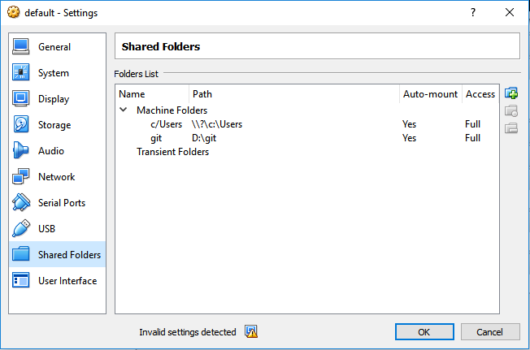

# Elastest Test Recommendation and Orchestrator Manager
The Test Orchestration and Recommendation Manager (TORM) is the brain of ElasTest and the main entry point for developers. TORM will provide a web interface to be used by testers, developers and administrators, to managing tests, test executions, systems under test, orchestrate tests and analyze logs. It will also provide a remote API that will used by ElasTest-CLI (a command line interface tool), by ElasTest Jenkins Plugin and by ElasTest Eclipse Plugin.

Before you start using ElasTest, you need to know the following terms:

- **Project**: Set of test specifications.
- **TJob**: Specification of a Test to run against any software.
- **SuT (System under Test):** Specification of the System that is being tested for correct operation.

## Features
The version 0.1 of the ElasTest TORM, provides the following features:

- Projects Management. 
- TJobs Management.  
- SuTs Management.
- Logs Management.

## How to run
To start using ElasTest, you need to follow the next steps. Several of these steps, are specific for Windows or Linux Operating Systems.

### Windows 
1.  Install [Docker Toolbox for windows](https://docs.docker.com/toolbox/toolbox_install_windows/).
Start Boo2docker Virtual Machine from Virtual Box GUI and connect via ssh. Execute `docker-machine ssh` from power shell or any terminal emulator. 
2.  Install [Docker Compose](https://docs.docker.com/compose/install/.) on the Virtual Machine Boot2docker created by Docker Toolbox installation. 
    - `sudo -i` (get access as superuser)    
    - ``curl -L https://github.com/docker/compose/releases/download/1.14.0/docker-compose-`uname -s`-`uname -m` > /usr/local/bin/docker-compose``
    - `chmod +x /usr/local/bin/docker-compose` 

3. Elasticsearch requires an increase of the max virtual memory to at least 262144 `sudo sysctl -w vm.max_map_count=262144`
4. Switch Docker API to non-TLS port.
    - Edit the file */var/lib/boot2docker/profile* with any editor `sudo vi /var/lib/boot2docker/profile`
    - Change the DOCKER_HOST value to be *'-H tcp://0.0.0.0:2375'*
    - Change the DOCKER_TLS value to be *no*.
    - Execute `exit` in the shell to leave SSH session.
    - Restart Boot2docker `docker-machine restart`


>**Note:** To this day, for each time the docker machine reboots, you will have to repeat the steps 2 and 3.

### Linux 
1. Install [Docker](https://docs.docker.com/engine/installation/).  
Install [Docker Compose](https://docs.docker.com/compose/install/).
    - `sudo -i` (get access as superuser)  
    - ``curl -L https://github.com/docker/compose/releases/download/1.14.0/docker-compose-`uname -s`-`uname -m` > /usr/local/bin/docker-compose``
    - `chmod +x /usr/local/bin/docker-compose` 

    > **Note:** For use Docker Compose file Version 2.1 you need Docker Engine version 1.12.0+ and Compose 1.9.0+.
    
2. Elasticsearch requires an increase of the max virtual memory to at least 262144. 
    - `sudo sysctl -w vm.max_map_count=262144`

3. Enable the tcp Socket.
    - Create the docker.conf file at the path `/etc/systemd/system/docker.service.d/docker.conf`
    - Edit file and add the following three lines:
    ```
    [Service]
    ExecStart=
    ExecStart=/usr/bin/dockerd -H tcp://0.0.0.0:2375 -H unix:///var/run/docker.sock
    ```
    > **Note:** If the directory *docker.service.d* does not exist, then you need create it.

4. Reload configuration.
    - `systemctl daemon-reload`
5. Restart docker service.
    - `systemctl restart docker.service`

### Download ElasTest TORM 
- Create a directory named *elastest-torm*, and change your current directory to this one.

- Download the docker compose file from the ElasTest TORM repository  
 `wget https://raw.githubusercontent.com/elastest/elastest-torm/master/docker-compose.yml`

    >**Note:** On Windows you must be inside boot2docker (`docker-machine ssh`).

### Start and stop ElasTest TORM
- `cd elastest-torm`
- `docker-compose -p elastest up `
- To stop ElasTest TORM press `Ctrl+C` in the shell

>**Note:** To run the latest version of ElasTest TORM you need to execute the command `docker image pull elastest/elastest-torm`, before running the docker-compose command.

## Basic usage
To use ElasTest and run your first test, you need to create at least one project and a TJob associated to the project. For this, start a Web Browser and enter the following URL:
- Linux: http://localhost:8091/ 
- Windows: http://\<docker-host>:8091/ (where \<docker-host> is obtained executing the command `docker-machine ip`)

</p>

### Create a Project.
- Click on item *Projects* in the menu on the left.
- Create a new Project. Fill in the field *Project Name* and click on *SAVE* button.
- Select the project by clicking on the row.
   
### Create a TJob
- From the Project management page, create a new TJob. In the TJobs card click on the button *New TJob*. Fill in the fields *TJob Name* and *Image Name*. The image's name must be refer to a docker image with the test to run inside.
    
### Execute a TJob
- From the list of TJobs you can execute a TJob by clicking on the play button.
- Then you will see the logs and metrics generated by the TJob execution.<p>
</p>

## Development documentation

### Arquitecture
The ElasTest TORM Platform is divide in three parts:
- ElasTest TORM Web Client Application.
- ElasTest TORM Server Application.
- ElasTest TORM Platform Services.

In the next diagram, you can to see The ElasTest TORM Components Architecture.


#### ElasTest TORM Web Client Application
This appication provides a friendly GUI to ElasTest TORM Platform, allowing to the users managment theirs test in a simple way. 

#### ElasTest TORM Server Application 
This application is the ElasTest TORM backend that provides the API to the Web Client Application to access the resources and implements integration with the rest of the platform services. It is a Java Application developed with SpringBoot, the Spring solution for creating stand-alone applications as quickly as possible.

#### ElasTest TORM Platform Services
ElasTest TORM uses several external components to implement the features it offers. These services are shown in the diagram and described below.

- **[MySql DB:](https://www.mysql.com/)** The DDBB System that uses the ElasTest TORM to store the persistent data, necessary to manage the Projects, TJobs, Suts and Executions.
- **[Logstash:](https://www.elastic.co/products/logstash)** As indicated on its website *"It is a server-side data processing pipeline that ingests data from a multitude of sources simultaneously, transforms it, and then sends it to your favorite *stash*"*. ElasTest TORM uses it to gather and parse logs and metrics produced by the execution of TJobs and SuTs. The logs and metrics are sent to Elasticsearch and RabbitMq servers.
- **[Dockbeat:](https://www.elastic.co/products/beats)** As indicated on its website "*Beats is the platform for single-purpose data shippers. They install as lightweight agents and send data from hundreds or thousands of machines to Logstash or Elasticsearch*". ElasTest TORM uses it to retrive container metrics generated from the docker containers executing TJobs and SuTs and send them to Logstash service.
- **[RabbitMQ:](https://www.rabbitmq.com/)** It is a message broker used as communication bus in ElasTest. It is used by ElasTest TORM to show in the web GUI metrics and logs.
	
### Prerequisites
To develop ElasTest it is necessary to have installed the following tools:

- [Java JDK 8](http://www.oracle.com/technetwork/java/javase/downloads/jdk8-downloads-2133151.html)
- [Maven 3.3.9](https://maven.apache.org/download.cgi)
- [Eclipse IDE](https://eclipse.org/ide/) or similar
- [Visual Studio Code](https://code.visualstudio.com/) or similar
- [Angular CLI](https://cli.angular.io/) 

### Prepare the environment
Following describes the necessary steps to configure the elastest-torm component development environment. Some of the actions to be performed will depend on the SO. 

1. Download the repository code from GitHub.

    - If you plan to contribute to the code, first create a fork of the GitHub repository in your account.
    - Then clone the repository in your development machine.

2. Make sure that you can execute TORM following the instructions specified in section [How to run].

3. If you are in Windows and you have cloned elastest-torm respository in a folder outside `C:\Users\` you need to share repository folder with the VirtualBox VM machine. For example, if the repository is cloned in `D:\git` you must have a VirtualBox configuration in boot2docker VM similar to: <p align="center">
</p>

### Running ElasTest TORM in development mode

#### Start ElasTest TORM platform services
First, you need to start platform services before you can execute TORM Server and Client applications. Follow this instructions to do it:

- Change the working directory to the project folder.
- Execute `docker-compose -f docker-compose-dev.yml up` from command prompt, to start the services.

 > **Note:** On Windows you must be inside boot2docker (`docker-machine ssh`).
 
 > **Note:** To stop the ElasTest TORM press `Ctrl+C` in the shell

#### Start ElasTest Server Application

First, be sure that the values of the following properties defined within the `elastest-torm/src/main/resources/application-dev.properties` file, are defined according your operating system.

* Windows `application-dev.properties`

    ``` 
    #Configuration for the dababase connection
    spring.datasource.url=jdbc:mysql://192.168.99.100:3306/elastest-etm?useSSL=false
    
    #RabbitMQ
    spring.rabbitmq.host= 192.168.99.100

    #Elasticsearch properties
    elastest.elasticsearch.host=http://192.168.99.100:9200/

    #Volume Path for Test Results 
    elastest.test-results.directory=/c/Users/docker/testresults
    elastest.test-results.directory.windows=C:\\Users\\docker\\testresults
    ```

* Linux `application-dev.properties`

    ```       
    #Configuration for the dababase connection
    spring.datasource.url=jdbc:mysql://localhost:3306/elastest-etm?useSSL=false    

    #RabbitMQ
    spring.rabbitmq.host= localhost

    #Elasticsearch properties
    elastest.elasticsearch.host=http://localhost:9200/

    #Volume Path for Test Results 
    elastest.test-results.directory=/test-results
    elastest.test-results.directory.windows=/test-results
    ```

Then, you can execute Server Application from command line or from Eclipse IDE:
* From *Eclipse IDE*: 
  * Import *elastest-torm* project from local Git Repository using `File > Import... > Maven > Import existing project` option option and select the `elastest-torm` folder, within the git repositoy folder.    
  * Right click over the project and select `Run as Java Application`

* From console:
    * Go to the root directory of the project with `cd <git-repository>\elastest-torm`
    * Execute command `mvn spring-boot:run`

#### ElasTest TORM Client Application
* From *Visual Studio Code*:
  * Open the preddddoject folder using `File > Open folder` option and select the `elastest-torm-gui` folder, within the git repositoy folder.
  * Open the integrated terminal with `View > Integrated Terminal`
  * Execute in integrated terminal:
    * `npm install`
    * `npm start`

* From console:
  * Go to the root directory of the project with `cd <git-repository>\elastest-torm-gui`
  * Execute:
    * `npm install`
    * `npm start`

The client application will be accessible at http://localhost:4200.
 
